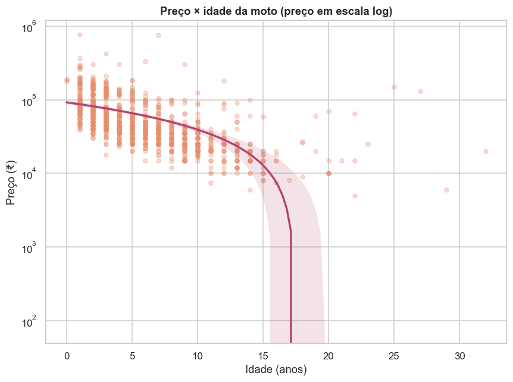
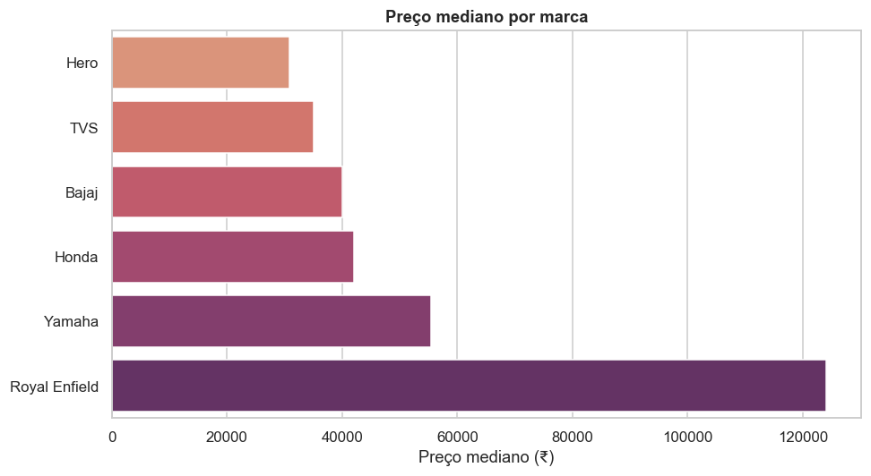
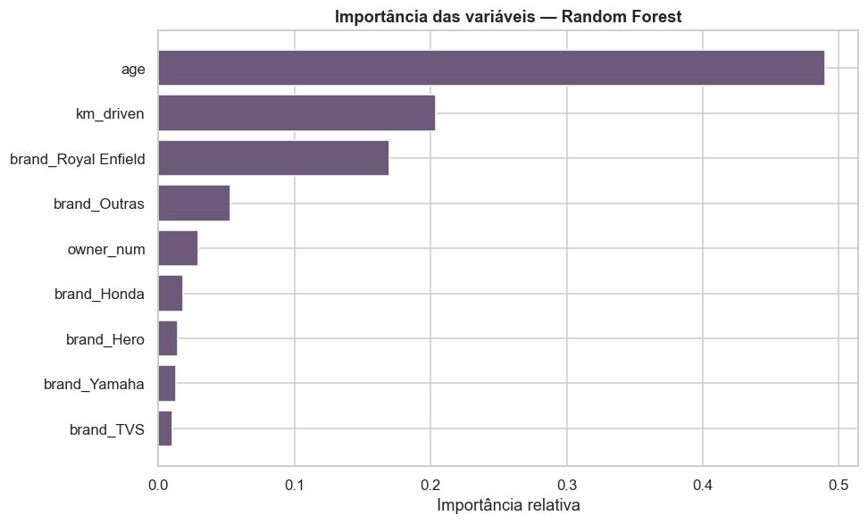

# 🏍️ Análise Estatística do Mercado de Motos Usadas

> Um estudo de dados **end-to-end** sobre ~1.050 anúncios de motocicletas usadas — da limpeza à modelagem preditiva — para entender o que dirige o **preço de revenda** e a **depreciação**, com **regressão linear**, **Random Forest** e **clusterização**.

<p align="left">
  
  
  
  
  
  
  
  
</p>

---

## 👤 Autor

**Gustavo Caldeira** — Analista de Dados

[](https://www.linkedin.com/in/gustavocaldeirads)
[](mailto:gustavocaldeirads@gmail.com)

---

## 📌 Contexto do problema de negócio

No mercado de motos usadas, **precificar corretamente** é o que separa um bom negócio de um prejuízo. Compradores querem saber se um anúncio está caro; revendedores precisam estimar o valor de revenda; plataformas querem detectar preços fora da curva. A pergunta central: **o que determina o preço de uma moto usada e quanto ela deprecia?**

A base reúne **1.051 motocicletas** (após limpeza) do mercado indiano, com preço de venda, ano, quilometragem, número de donos, tipo de vendedor e o preço de tabela (*ex-showroom*). Buscamos responder:

- 📉 Quanto uma moto **deprecia por ano** e por km rodado?
- 🏷️ Quais **marcas retêm mais valor**?
- 👥 O **número de donos anteriores** realmente derruba o preço?
- 🤖 É possível **prever o preço de revenda** com boa precisão?

> **Decisão de dados:** o `ex_showroom_price` (preço de tabela) tem ~41% de ausência e é, essencialmente, o preço de onde o usado *deprecia*. Usá-lo como preditor seria **vazamento de alvo** — então ele fica de fora do modelo e serve apenas para medir a **taxa de revenda**. Também removemos registros implausíveis (ex.: uma moto com 880.000 km).

---

## 🧪 Metodologia estatística

| # | Etapa | Técnicas | Por que foi escolhida |
|---|-------|----------|------------------------|
| 1 | **Limpeza & Preparação** | Extração de marca/idade/nº de donos, regras de negócio | Cria preditores úteis e remove erros de digitação que distorceriam tudo. |
| 2 | **Estatística Descritiva** | Média, mediana, CV, assimetria, curtose, normalidade | O preço é fortemente assimétrico — daí o uso de log na modelagem. |
| 3 | **EDA Avançada** | Outliers (IQR/Z-score), correlação **Pearson e Spearman**, bivariada | Spearman revela a depreciação **não-linear** que Pearson subestima. |
| 4 | **Estatística Inferencial** | **Teste t de Welch**, **ANOVA**, intervalos de confiança | Testa o efeito do nº de donos e das marcas sobre o preço. |
| 5 | **Modelagem** | **Regressão Linear (OLS)** sobre log(preço) + **Random Forest** + **K-Means** | Explica, prevê (comparando linear vs não-linear) e segmenta o mercado. |

---

## 💡 Principais insights

> Resultados obtidos na execução completa do pipeline (`python main.py`).

### 1. 📉 A idade é o maior carrasco do preço
A depreciação é o fator dominante: cada **ano a mais reduz o preço em ~8%** (regressão OLS; p < 0,001), e a idade responde por **49% da importância** no Random Forest. A correlação de **Spearman (−0,70)** é bem mais forte que a de Pearson (−0,40), revelando uma queda de valor **não-linear** — acentuada nos primeiros anos.



### 2. 🏆 Royal Enfield é a campeã de retenção de valor
Diferenças de preço entre marcas são **altamente significativas** (ANOVA: F = 169; **p ≈ 10⁻¹²⁹**). A Royal Enfield se destaca em dobro:

| Marca | Preço mediano | Taxa de revenda* |
|-------|--------------:|:----------------:|
| **Royal Enfield** | ₹124.000 | **0,81** |
| Yamaha | ₹55.500 | 0,69 |
| Honda | ₹42.000 | 0,67 |
| Bajaj | ₹40.000 | 0,59 |
| Hero | ₹30.900 | 0,65 |

<sub>*Taxa de revenda = preço usado / preço de tabela. Quanto maior, menos a moto deprecia.*</sub>

Na regressão, ser **Royal Enfield** multiplica o preço por ~2,7× (coef. log = +0,99) frente à referência. **No geral, motos usadas vendem por ~66% do preço de tabela.**



### 3. 👥 O número de donos **não** afeta o preço (resultado nulo)
Contrariando a intuição, motos de 1º dono (₹60.186) **não** valem significativamente mais que as de múltiplos donos (₹57.481) — **teste t: p = 0,71**, e o coeficiente é não significativo na regressão (p = 0,20). O que pesa é a idade e a quilometragem, não quantas mãos passaram pela moto.

### 4. 🤖 Modelo preditivo sólido (R² ≈ 0,68)
A **Regressão Linear** sobre log(preço) atinge **R² = 0,68** em teste — e o **Random Forest** (R² = 0,66) **não supera** a versão linear, indicando que a relação, em escala log, é essencialmente **linear**. As variáveis mais importantes: idade (0,49), quilometragem (0,20) e a marca Royal Enfield (0,17).



### 5. 🧩 Quatro segmentos de mercado (K-Means)
| Cluster | Perfil | Nº motos | Preço médio | Idade | Km |
|--------:|--------|---------:|------------:|------:|---:|
| 1 | 🔝 Premium/seminovas | 130 | ₹165.369 | 2,4 anos | 10k |
| 0 | 🟢 Recentes populares | 551 | ₹52.309 | 4,4 anos | 22k |
| 2 | 🟡 Usadas medianas | 128 | ₹45.898 | 8,5 anos | 37k |
| 3 | 📉 Antigas/rodadas | 242 | ₹27.664 | 10,6 anos | 57k |

---

## 📂 Estrutura do repositório

```
Motorcycle/
├── data/
│   ├── raw/bike.csv                     # fonte
│   └── processed/                       # base limpa (gerada pelo pipeline)
├── src/
│   ├── config.py                        # caminhos e parâmetros centralizados
│   ├── data_loader.py                   # 1. carregamento
│   ├── preprocessing.py                 # 2. limpeza + feature engineering
│   ├── descriptive_stats.py             # 3. descritiva (assimetria, curtose, normalidade)
│   ├── eda_advanced.py                  # 4. outliers + correlação + preço por marca
│   ├── inferential_stats.py             # 5. teste t, ANOVA, IC
│   ├── modeling.py                      # 6. regressão linear + Random Forest + K-Means
│   └── visualization.py                 # funções de plotagem
├── notebooks/
│   ├── notebook_de_analise.ipynb        # narrativa importando src/
│   └── notebook_eda_original.ipynb      # EDA original (versão anterior do projeto)
├── reports/figures/                     # gráficos exportados
├── main.py                              # orquestra o pipeline completo
├── requirements.txt
├── .gitignore
└── README.md
```

### 🧱 Decisões de engenharia
- **Modularidade**, **tipagem** e `dataclasses` para resultados estruturados.
- **Configuração central** em `config.py` (sem números mágicos).
- **Reprodutibilidade**: `random_state` fixo e dependências travadas.

---

## 🚀 Como executar localmente

### 1. Clonar
```bash
git clone https://github.com/gustavocaldeirasantos/Motorcycle.git
cd Motorcycle
```

### 2. Ambiente virtual
**Windows (PowerShell):**
```powershell
py -m venv .venv
.\.venv\Scripts\Activate.ps1
```
**Linux / macOS:**
```bash
python3 -m venv .venv && source .venv/bin/activate
```

### 3. Dependências
```bash
pip install -r requirements.txt
```

### 4. Rodar o pipeline completo
```bash
python main.py
```
Executa todas as etapas, salva a base limpa em `data/processed/` e os gráficos em `reports/figures/`.

### 5. (Opcional) Módulo isolado
```bash
python -m src.eda_advanced
python -m src.modeling
```

### 6. (Opcional) Notebook
Abra `notebooks/notebook_de_analise.ipynb` no VS Code/Jupyter e selecione o kernel do `.venv`.

---

## 🛠️ Tecnologias

`Python` · `Pandas` · `NumPy` · `SciPy` · `statsmodels` · `scikit-learn` · `Seaborn` · `Matplotlib`

---

## 📜 Licença

Distribuído sob a licença **MIT**.

---

<sub>📊 Projeto de portfólio — análise de dados com fundamentação estatística. Dataset público de motos usadas (mercado indiano; preços em ₹).</sub>
